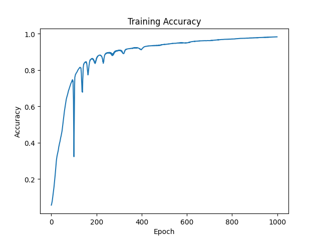
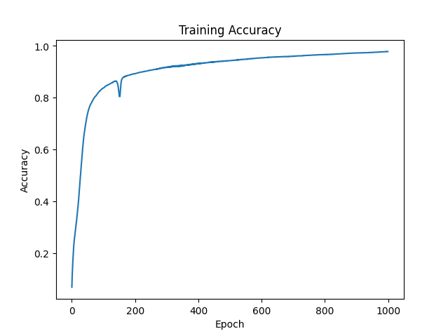
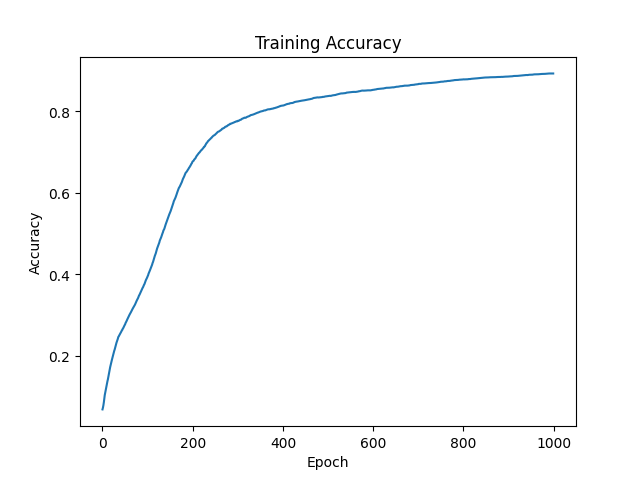
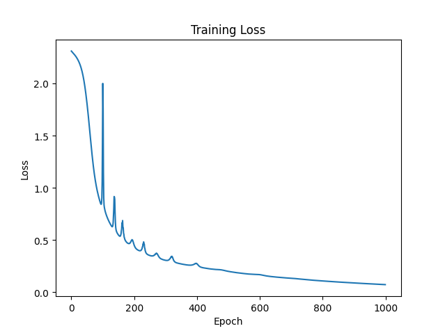
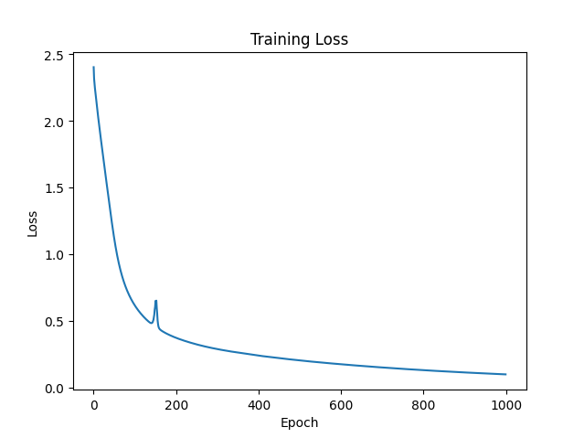
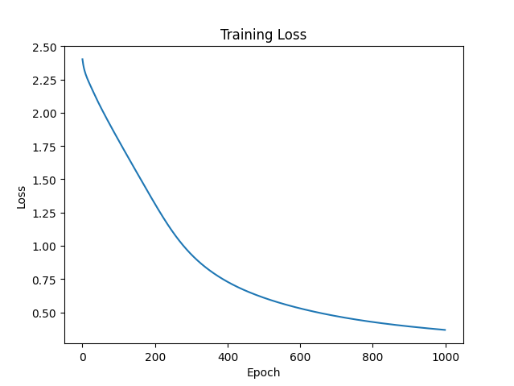

# NeuralNetworkNumPY

A fully connected neural network implemented from scratch using **NumPy**, trained on the **MNIST** dataset.

## Training Results

All experiments below were trained for **1000 epochs**.

---

## Training Accuracy

### Learning Rate: 0.01

### Learning Rate: 0.005

### Learning Rate: 0.001

---

## Training Loss

### Learning Rate: 0.01

### Learning Rate: 0.005

### Learning Rate: 0.001

---

## Implementation

The neural network is implemented entirely using NumPy.

- Forward propagation
- Backpropagation
- ReLU activation
- Softmax output
- Cross-entropy loss
- Gradient descent
- MNIST classification
- Training and loss visualization

---
## NOTE
**To change the learning rate edit line 104 and 105**
